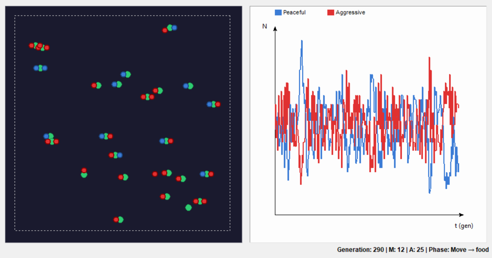
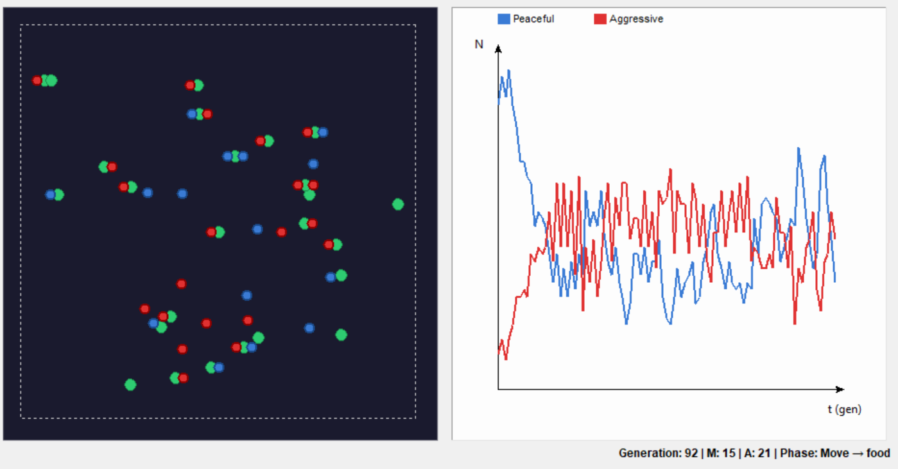
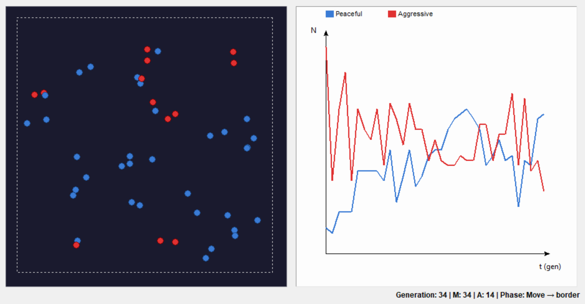
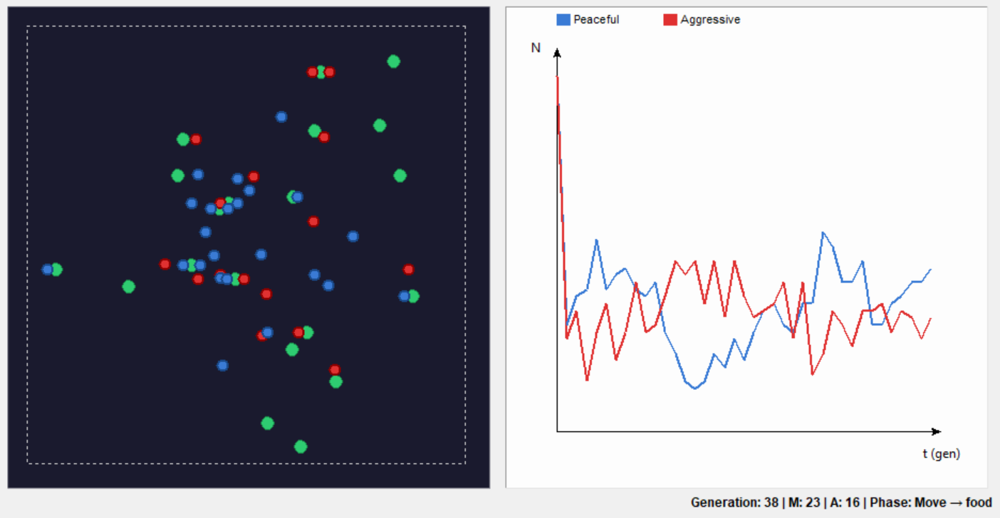
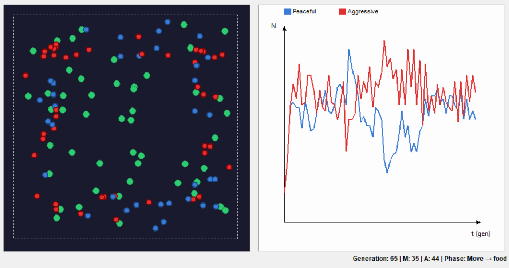

# Poročilo: Evolucija Agresije (Teorija Iger)

## 1. Uvod

Cilj te naloge je simulirati in analizirati obnašanje dveh vrst agentov – **Miroljubnih (Peaceful)** in **Agresivnih (Aggressive)** – v okolju z omejenimi viri (hrana). Simulacija temelji na principih teorije iger (podobno igri *Hawk-Dove*), kjer uspeh posameznika ni odvisen le od njegove lastne strategije, temveč tudi od strategije nasprotnika, s katerim se sreča ob hrani.

Pravila interakcije so sledeča:

| Srečanje | Rezultat za Miroljubnega (M) | Rezultat za Agresivnega (A) |
| :--- | :--- | :--- |
| **Sam pri hrani** | Preživi + se razmnoži (1 potomec) | Preživi + se razmnoži (1 potomec) |
| **M + M** | Oba preživita, se ne razmnožita | / |
| **A + A** | / | Oba umreta |
| **M + A** | 50% verjetnost preživetja | Preživi + 50% verjetnost razmnožitve |

## 2. Hipoteza

Z evolucijskega stališča pričakujemo, da nobena strategija ne bo popolnoma prevladala v vseh pogojih (Evolucijsko Stabilna Strategija - ESS).

- **Agresivni agenti** imajo prednost, ko je v populaciji veliko miroljubnih, saj ob srečanju z njimi vedno zmagajo (dobijo več hrane). Vendar pa so zelo ranljivi, ko je populacija agresivnih visoka, saj srečanja A+A vodijo v smrt obeh.
- **Miroljubni agenti** so "varni" drug do drugega (nikoli ne umrejo ob srečanju), vendar se v parih ne razmnožujejo, kar omejuje njihovo eksponentno rast, ko je hrane malo in gneča velika.

Pričakujemo ciklično obnašanje populacije ali ustalitev v nekem ravnovesju, kjer sobivata obe vrsti.

## 3. Scenariji simulacije

V nadaljevanju so predstavljeni ključni scenariji, ki smo jih opazovali v simulaciji.

### Scenarij 1: Uravnotežen začetek (Balanced)
*Začetni pogoji: 20 Miroljubnih, 20 Agresivnih, 25 parov hrane.*

V tem scenariju opazujemo naravno dinamiko tekmovanja. Ker je hrane relativno dovolj (50 mest za hranjenje na 40 agentov), se v prvih generacijah obe populaciji lahko širita. Ko se kapaciteta okolja zapolni, postanejo srečanja pogostejša.

**Opažanja:**
- Populacija agresivnih običajno sprva naraste.
- Ko agresivni postanejo preštevilni, se začnejo medsebojno iztrebljati, kar omogoči ponoven vzpon miroljubnih.

### Scenarij 2: Invazija Agresivnih (Peaceful Dominant)
*Začetni pogoji: 40 Miroljubnih, 5 ali 10 Agresivnih.*

To je klasičen primer, kjer v populacijo "golobov" (M) pridejo "jastrebi" (A). Ker je verjetnost, da sreča Agresivni drugega Agresivnega majhna, Agresivni večinoma srečujejo Miroljubne in zmagujejo.

**Opažanja:**
- Pričakujemo hitro in eksplozivno rast števila agresivnih agentov.
- Populacija miroljubnih drastično pade.
- Sistem se sčasoma uravnovesi ali zaniha, ko agresivni postanejo preštevilni.

### Scenarij 3: Samouničenje Agresivnih (Aggressive Dominant)
*Začetni pogoji: 5 Miroljubnih, 40 Agresivnih.*

V okolju, prenasičenem z agresijo, je cena konfliktov previsoka. Večina hrane postane "smrtonosna past", saj se na njej srečata dva agresivna agenta.

**Opažanja:**
- Populacija doživi drastičen zlom (crash) že v prvih nekaj generacijah.
- Obstaja velika verjetnost izumrtja agresivnih agentov, če padejo na 0.
- Miroljubni agenti, ki se uspejo izogniti agresivnim (ali imajo srečo pri preživetju), lahko po zlomu agresivne populacije počasi obnovijo svojo populacijo.

### Scenarij 4: Pomanjkanje hrane (Scarcity)
*Začetni pogoji: 20 Miroljubnih, 20 Agresivnih, 10 parov hrane.*

Ko je virov malo, je tekmovanje neizprosno. Vsako srečanje pri hrani postane ključno, saj je prostora le za 20 agentov.

**Opažanja:**
- Populacija se hitro zmanjša in prilagodi nosilnosti okolja.
- Agresivni agenti so v kratkoročni prednosti, saj "ukradejo" hrano miroljubnim, vendar zaradi velike gostote in agresije pogosto pride do medsebojnega uničenja.
- Sistem je zelo nestabilen; pogosto ena vrsta hitro izumre zaradi stohastičnih nihanj v majhni populaciji.

### Scenarij 5: Obilje hrane (Abundance)
*Začetni pogoji: 10 Miroljubnih, 10 Agresivnih, 100 parov hrane.*

V okolju z obiljem hrane je interakcij na začetku zelo malo. Večina agentov najde prosto hrano in se hrani sama (brez tekmeca).

**Opažanja:**
- Opazimo eksponentno rast obeh populacij v začetnih generacijah.
- Ker je konfliktov malo, se obe vrsti razmnožujeta skoraj z maksimalno hitrostjo.
- Do "Hawk-Dove" dinamike pride šele kasneje, ko populacija preseže kapaciteto hrane (200 osebkov) in se začne gneča.

## 4. Vpliv razpoložljivosti virov

Količina hrane neposredno vpliva na *carrying capacity* (nosilnost okolja) in intenzivnost selekcijskega pritiska.

1.  **Pomanjkanje:** Poveča selekcijski pritisk. Napake (npr. miroljubni, ki ne najde hrane, ali agresivni, ki sreča agresivnega) se kaznujejo hitreje. Agresivnost je "visoko tveganje, visoka nagrada".
2.  **Obilje:** Zmanjša selekcijski pritisk. Omogoča preživetje in razmnoževanje tudi vsem strategijam, dokler se viri ne zapolnijo. V fazi rasti je pomembna le hitrost reprodukcije.

## 5. Ugotovitve in Zaključek

Na podlagi simulacij in grafov lahko odgovorimo na vprašanje: **Katero bitje ima boljšo verjetnost za preživetje?**

Odgovor ni enoznačen, temveč odvisen od **trenutnega stanja populacije**:

1.  **Agresivno bitje (A)** je individualno močnejše in ima boljšo verjetnost preživetja v okolju, kjer prevladujejo Miroljubni. Agresija se "splača", dokler je redka.
2.  **Miroljubno bitje (M)** je dolgoročno stabilnejša strategija za preživetje vrste, vendar je ranljiva na invazijo agresivnih posameznikov.
3.  **Skupna dinamika:** Agresivni agenti delujejo kot regulatorji populacije. Če jih je preveč, se uničijo. Če jih je premalo, se namnožijo na račun miroljubnih.

Najboljšo verjetnost za dolgoročni obstoj ima torej **mešana populacija**, kjer se vzpostavi dinamično ravnovesje. Čista populacija agresivnih je nagnjena k hitremu propadu, medtem ko je čista populacija miroljubnih stabilna le, dokler se ne pojavi mutacija ali vsiljivec z agresivno strategijo.

