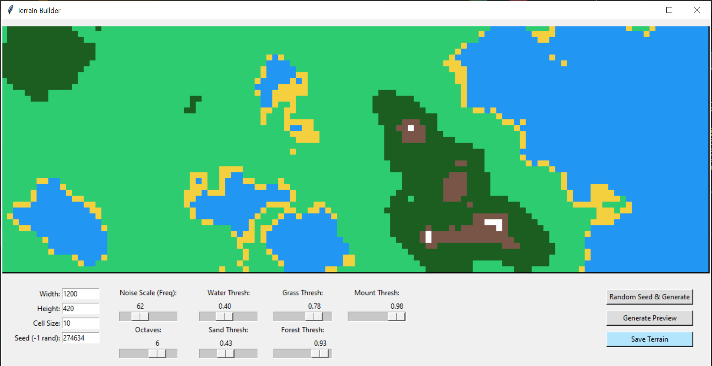
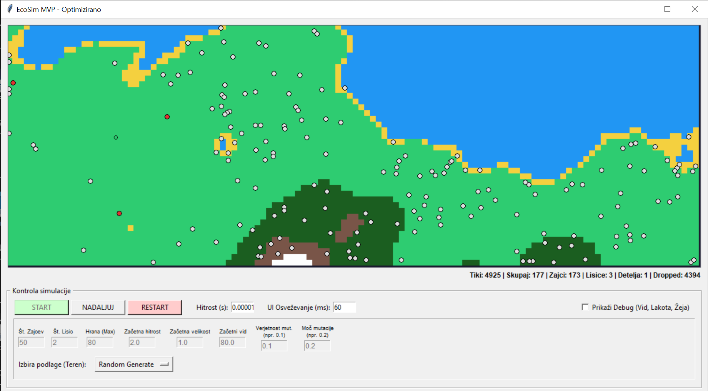
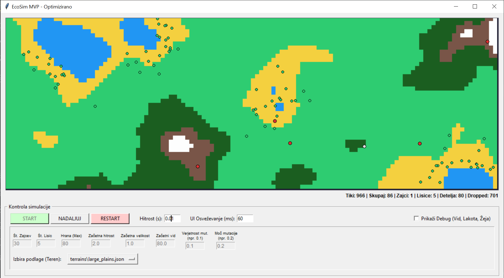
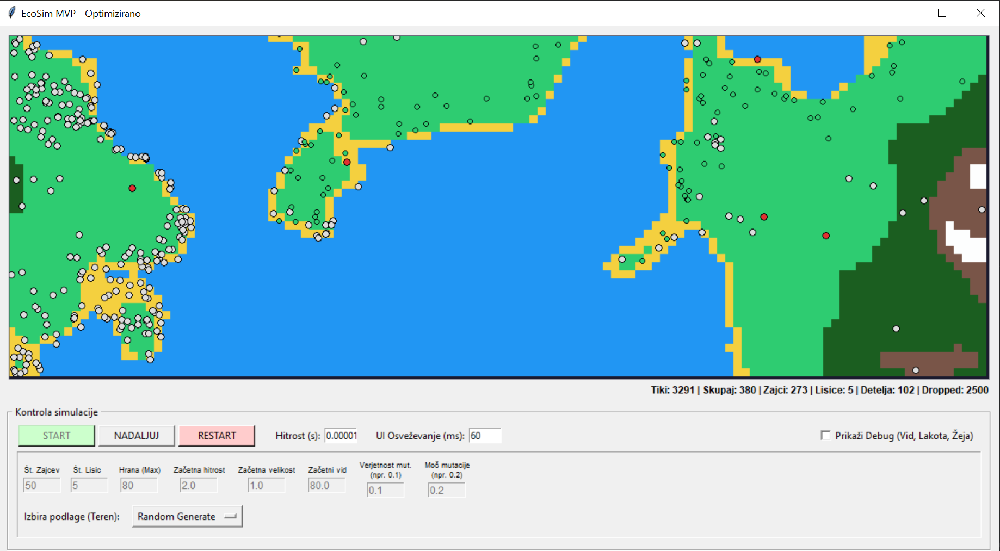

# Ecosystem Simulation Report

## 1. Introduction
This report documents the architecture, logic, and emergent behaviors of the predator-prey ecosystem simulation. The application models the interactions between autonomous agents (Prey and Predators) within a constrained, customizable resource environment (Grass, Water, and Obstacles).

## 2. Terrain Generation and Environment
The simulation environment is driven by a grid-based terrain system. 

### Terrain Builder
The terrain is created and edited using the `TerrainBuilder` class prior to running the simulation. It provides a visual, interactive canvas where the user can paint different types of tiles:
- **Empty (Grass/Plains)**: Walkable areas where grass can grow and agents can move.
- **Lake (Water)**: Impassable barriers for land animals. Forms natural boundaries and islands.
- **Obstacle (Rocks/Walls)**: Impassable terrain used to structure the land.

*(Placeholder: Add a screenshot of the Terrain Builder interface here)*

The custom terrains are saved as structurally simple JSON files `.json` which capture the grid dimensions, cell size, and a matrix representing the terrain layout. When the simulation normally launches, `Environment` parses this matrix, initializing the world.

## 3. System Architecture & Important Classes

The application relies on a modular architecture to split responsibilities between UI rendering, multi-threaded simulation, spatial management, and the core agent logic. 

- **`App` & `SimThread`**: The application separates the Tkinter user interface (`App`) from the core simulation loop (`SimThread`). This allows real-time adjustments of simulation parameters while calculating complex multi-agent interactions asynchronously.
- **`Terrain` & `SpatialGrid`**: `Terrain` manages the base environment (Lakes, Ground, Obstacles) loaded from structure files, while `SpatialGrid` partitions the world into a 2D grid so agents can query local neighbors efficiently without massive performance losses (O(N^2) complexity).

At the simulation's heart lies the central agent hierarchy. There is **one core agent class** that dictates overarching physics and states, while different agent species override and extend this base to create unique patterns of life:

- **`Agent` (The Core Base Class)**: Dictates the foundational rules for all living entities within the simulation. This single class manages position, velocity/steering, energy consumption, age, metabolism, wandering boundaries, terrain collision (avoiding water/walls), and basic perception (finding neighbors via the spatial grid). Every entity in the sim is fundamentally an `Agent`.
- **`Clover` (Inherits `Agent`)**: The primary resource of the ecosystem. While technologically an agent, Clover overrides default movement behaviors to remain completely stationary. Its core logic consists strictly of slow, asexual reproduction when mature, essentially storing energy for herbivores to consume.
- **`Prey` (Inherits `Agent`)**: Implements flighty, herd-based herbivore patterns. Utilizing the base agent vision and steering systems, Prey define specific logic layers to: flock with their own kind (alignment, separation, cohesion), seek the nearest detected Clover when hungry, and most crucially, apply massive evasion forces when they spot a Predator.
- **`Predator` (Inherits `Agent`)**: Defines aggressive carnivore patterns. They disregard flocking and instead use powerful localized steering curves and speed bursts to track and consume the nearest Prey. They possess steeper energy drop-offs, suffering rapid starvation if successfully evaded by Prey.

## 4. Agent Behavior and Logic Base

At the microscopic level, agent decision-making is driven by calculating vectors (forces) within a local neighborhood structure. Agents independently evaluate their surroundings to choose one of several prioritized movement routines each frame.

1. **Energy, Metabolism & Lifecycle**:
   - Both Prey and Predators have an active metabolism. Every frame, their energy simply decreases by a set amount (`metabolism`). 
   - If an agent's energy reaches 0, it dies of starvation and is removed.
   - **Sexual Reproduction & Genetics**: Reproduction is not asexual. When an agent's energy passes a high threshold (e.g., `REPRODUCE_ENERGY_PREY`), it enters a `ready_to_mate` state. It must then find a nearby partner (within 15 units) of the same species that is also ready to mate. When they reproduce, both parents sacrifice a chunk of energy (`MATING_COST`) to spawn an offspring. The offspring inherits a blended average of its parents' genetic traits (max speed, steering force, and sense radius), which are then subject to a slight random mutation (+/- 5%), allowing the species to slowly evolve over generations.

2. **Prey Logic & Stimuli Priorities**:
   Prey query their surroundings using the spatial grid (radius 80) and calculate forces based on priority tiers:
   - **Tier 1: Survival (Fleeing)**: If predators are in range, a heavy fleeing force is calculated away from the nearest predator. Flocking cohesion and alignment are abandoned. Only evasion and separation (so prey don't get stuck clumping) are applied.
   - **Tier 2: Foraging**: If no predator is immediately visible, and the prey is significantly hungry (under 80% maximum energy), it hunts for the nearest `Clover`. It applies a steering force toward the food while maintaining mild flocking. If it gets within 10 units, it consumes the clover to completely refill its energy.
   - **Tier 3: Herd Wandering**: If not actively fleeing or foraging, prey wander randomly while applying full flocking algorithms: separation (avoiding overlapping with friends), alignment (matching the velocity of neighbors), and cohesion (steering towards the center of the nearby herd).

3. **Predator Logic & Stimuli Priorities**:
   Predators scan in a much larger radius (150 units). Their logic is more singular:
   - **Hunting**: They locate the nearest prey and strictly apply a massive seeking force towards it. Once they close within 15 units, the prey dies, and the predator gains a chunk of energy (`PREY_HUNGER_RECOVERY`).
   - **Anti-clumping**: Predators do not flock like prey (no alignment or cohesion); however, they do calculate a basic separation force among themselves to fan out when chasing the same prey.
   - If no prey is found at all, they resort to randomized wandering combined with separation.

4. **Environmental Avoidance**:
   Regardless of what action an agent is taking, the base `Agent` update heavily overrides positioning if the agent nears the map edge, impassable obstacles, or water (`LAKE`). The agent calculates the specific tile type ahead and forcefully injects vectors that steer it directly away from the impassable terrain.

## 5. Ecosystem Dynamics, Hidden States, and Emergent Conditions
The interaction between localized agent behaviors and map geography leads to compelling, large-scale macro-patterns. The simulation rarely stays fully static; it cycles through several "hidden ordered states."

### A. The Eden Trap (Prey Overrun)
When prey find themselves entirely devoid of predators (e.g., all predators starved, or the prey spawned on an isolated, predator-free island), they enter a state of unregulated exponential growth.
- **Mechanism:** Prey continuously eat and reproduce. Without predators culling their numbers, their population explodes.
- **The Consequence:** The massive herd over-grazes the environment. The grass regeneration rate (`GRASS_REGROWTH_TIME`) cannot keep up. Eventually, entire areas become barren, stunting further population growth and forcing massive migrations as the herd desperately scours for remaining food patches. 

*(Placeholder: Add a screenshot of a massive prey herd on a barren field)*

### B. The Collapse (Predator Overrun & Extinction)
Predators are highly efficient hunters. If their spawn rates are too high, or a dense pocket of prey provides too much food, predators reproduce uncontrollably.
- **Mechanism:** The predator population surges, quickly overwhelming the prey's capability to hide, flee, or reproduce. 
- **The Consequence:** The prey population falls to exactly zero (Extinction). Because predators cannot eat grass and are programmed to constantly lose energy, the predators rapidly begin to starve. Within moments, the massive predator population completely collapses, leaving behind an empty, peaceful, grass-filled landscape.

*(Placeholder: Add a screenshot of starving predators after wiping out prey)*

### C. The Geographic Isolation (Island Micro-Ecosystems)
Because water (Lakes) and obstacles act as rigid movement barriers, terrains with large bodies of water naturally sever populations into isolated micro-ecosystems. 
- **Mechanism:** A large map might have a stable mainland ecosystem, but a connected peninsula or island might be cut off.
- **The Consequence:** If an island happens to spawn only prey, it becomes heavily overpopulated. If it spawns predators and prey, the smaller landmass accelerates the "Collapse" scenario because prey cannot flee far enough. This allows the simulation to exhibit simultaneous, wildly different ecological states purely depending on geographic separation.

### D. Boom and Bust Cycles (The Delicate Balance)
Under the right conditions (usually on large, open plains with plenty of space for prey to scatter), the system enters classic Lotka-Volterra population cycles.
- Predator numbers rise as they successfully hunt.
- Prey numbers drop, making it suddenly very difficult to find food.
- Predators starve, heavily reducing their numbers.
- With fewer predators, the remaining prey reproduce rapidly.
- The cycle begins anew.

*(Placeholder: Add a screenshot of the population history graph showing the boom-and-bust cycle)*

